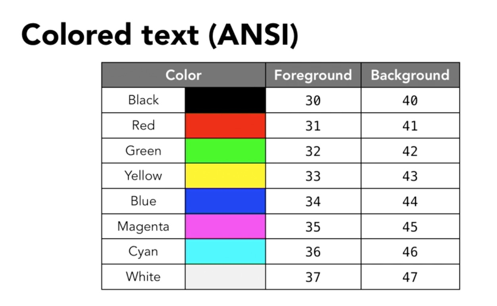
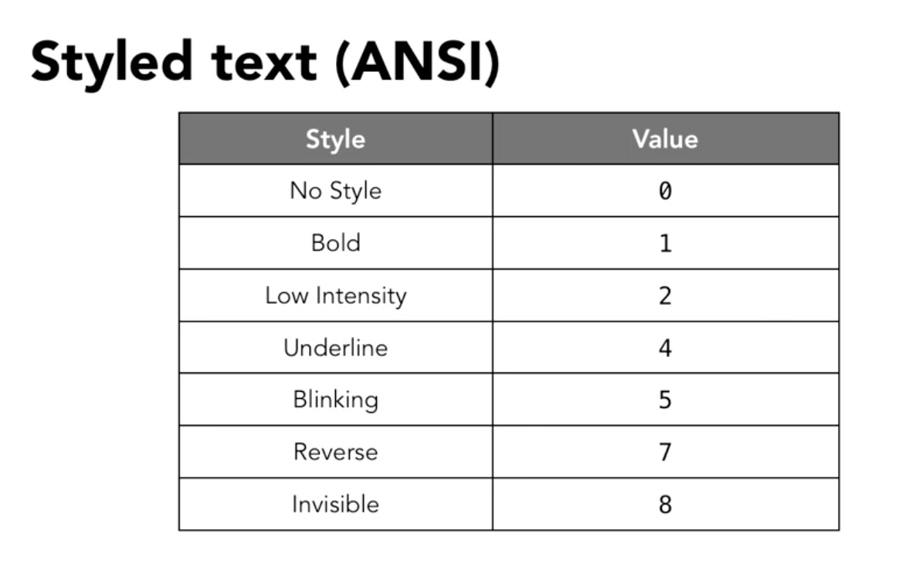
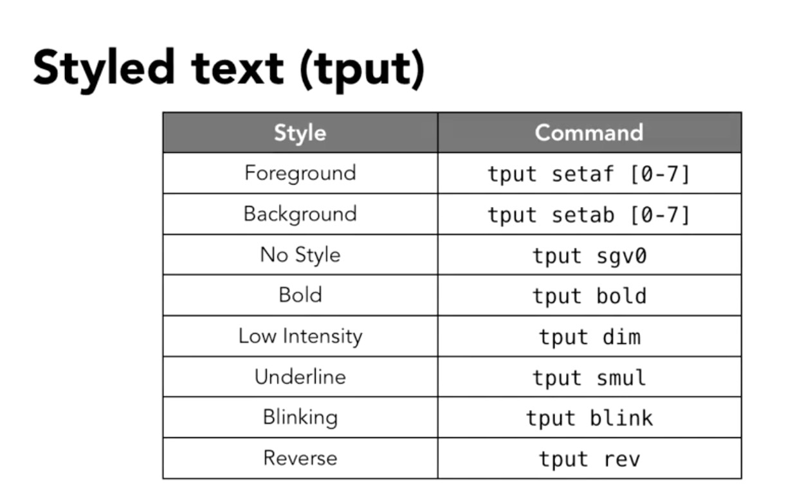
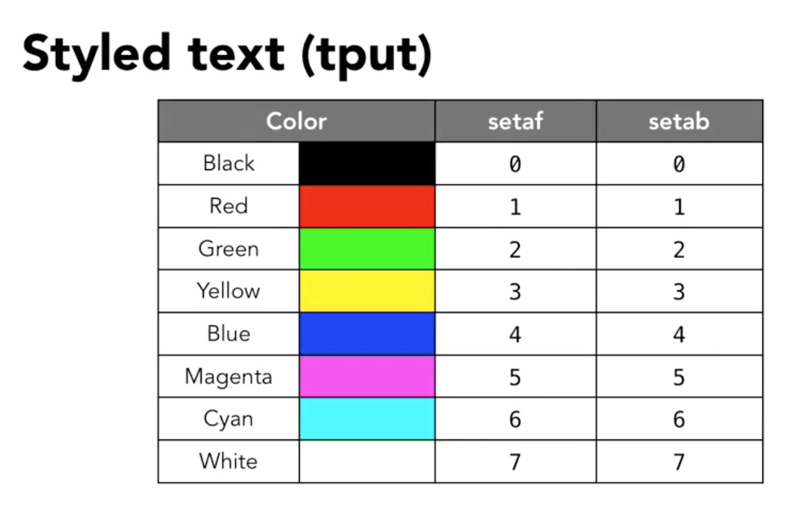

A Guide to the Born Again SHell
===============================

-   [Common Bash Commands](#common-bash-commands)
-   [Storage and System Commands](#storage-and-system-commands)
-   [Add-in Commands](#add-in-commands)
    -   [Flags](#flags)
-   [Standard Input, Standard Output and Standard
    Error](#standard-input-standard-output-and-standard-error)
    -   [Standard Redirect Commands](#standard-redirect-commands)
-   [Wildcards (`*`, `?`)](#wildcards)
-   [Expansions](#expansions)
    -   [Tilde Expansion](#tilde-expansion)
    -   [Brace Expansion](#brace-expansion)
-   [Variables](#variables)
    -   [Adding attributes to
        variables](#adding-attributes-to-variables)
    -   [Command Substitution](#command-substitution)
    -   [Arithmetic Operations](#arithmetic-operations)
-   [String Manipulation](#string-manipulation)
-   [Arrays](#arrays)
    -   [Associative Elements](#associative-elements)
-   [Navigation and Editing
    Shortcuts](#navigation-and-editing-shortcuts)
-   [File Permissions](#file-permissions)
-   [File Browsing & Editing](#file-browsing-editing)
    -   [`more` Command](#more-command)
    -   [`less` Command](#less-command)
-   [User Profiles](#user-profiles)
-   [Environmental Variables](#environmental-variables)
-   [Bash Scripting](#bash-scripting)
-   [Control Structures](#control-structures)
    -   [Value Comparison](#value-comparison)
    -   [Integer Comparison](#integer-comparison)
    -   [`if` statements](#if-statements)
    -   [`while` & `until` Loops](#while-until-loops)
    -   [`for` Loops](#for-loops)
    -   [`case`](#case)
-   [Functions](#functions)
    -   [Argument Expansion Options](#argument-expansion-options)
-   [Coloring & Styling Text](#coloring-styling-text)
    -   [`tput`](#tput)
-   [Here Documents](#here-documents)
-   [Super Users](#super-users)
-   [Quotes in Bash](#quotes-in-bash)
-   [Miscellaneous](#miscellaneous)
-   [Acknowledgments](#acknowledgments)

Bash is a command-line language that stands for Bourne Again Shell. It
follows the Unix core-philosophy: *Tools should do one thing, and do it
well.* Unix Bash script follows the following basic syntax

    command option(s) argument(s)

Where `command` is a specific function, `option(s)` modify that function
and `argument(s)` are the data used as an input

Common Bash Commands
--------------------

-   `bash`: interpret script file(s) with Bash
-   `bg [job_#]`: restart a suspended job and send to the background
-   `cat`: output contents of file to terminal
    -   `tac`: prints file in reverse line order
    -   `rev`: prints file out in reverse character order
-   `cd <path>`: change directory to `path`
    -   `cd ..`: change up one directory (i.e., parent directory)
    -   `cd`: change to home directory
    -   `cd -`: change to last directory
-   `chmod`: change file mode bits. `perm` permission options include
    `r` for read, `w` for write and `x` for executable. A `+` adds these
    permissions, while `-` removes them.
-   `chown`: change ownership of a file (or directory w/ `-R`). Example:
    `chown -R $USER /media/kDubs/Backup` changes all files within
    `Backup` to be owned by the current `$USER`.
-   `clear`: clear's command terminal records
-   `cp <path/to/file.txt> <target/dirORfile>`: copy `file` to another
    file or a new directory. E.g., `cp filename.txt` (...additional
    files...) `file2.txt`: copies the contents of `filename.txt` to
    `file2.txt`. `cp dir1/filename.txt (...additional files...) dir2/`:
    copies `filename.txt` to `dir2` directory.
    -   `scp <path/to/file> <path>`: secure version of `cp` for remote
        transfer.
-   `cut`: Remove or 'cut-out' sections of each line of a file or files.
    For example, `file.txt` with the following information:

```{=html}
<!-- -->
```
    one     two     three   four    five
    alpha   beta    gamma   delta   epsilon

May be cut with `cut -f (--fields) 2 file.txt`. This will produce:

    two
    beta

-   `date`: return the date-time to the standard out. For example:
    `date +"%d-%m-%Y"` returned `28-06-2017` when I wrote it just now.
-   `echo`: print to terminal. There are three conditions for printing.
-   `env`: list environmental variables
-   `exit`: end terminal session
-   `export`: set environmental variable, accessible to sub-processes.
    E.g., `export name=value`.
-   `fg [job#]`: send to the foreground a job running in the background
-   `grep` 'global regular expression print', for example,
    `grep Mount mountains.txt`.
    -   Options: `-i`: case insensitive, `-R`: recursive (directory),
        `-l`: files with matches (rather than matches themselves), `-n`:
        shows line of match, `i`: case insensitive
-   `help`: a summarized `bash` command directory for syntactical
    reference.
-   `history`: list history of used commands
-   `jobs`: show jobs running in the background, sent by `&`.
-   `kill`: end processes running on the system. For example
    `kill -1 1234` kills process ID `1234` with the lowest priority
    (i.e., `-1`, 'hang-up').
-   `ls`: list files in working directory
    -   Options: `-a` (all files), `-l` (long format), & `-t` (order by
        time last modified)
-   `ln`: create a link to another directory or file (symbolic links
    only). The `-s` option makes the link *symbolic*, and is
    distinguishable from the original directory or file. By default,
    `ln` creates a *hard* link to a file, which is indistinguishable
    from the original (i.e., changes to one affects all)
-   `man`: manual pages, e.g. `man ls` opens the manual for the `ls`
    command.
-   `mkdir`: make directory
    -   `mkdir dir1` creates a directory, `dir1`.
-   `mv`: move or rename a file
    -   `mv file.txt dir1/`: moves `file.txt` in CWD to `dir1` OR
    -   `mv file1.txt file2.txt`: changes the name of `file1.txt` to
        `file2.txt`
-   `nano`: terminal text editor
    -   `nano 'file.txt'`: opens `file.txt` for editing
-   `pbcopy` (OSX only) - copy to clipboard
-   `pbpaste` (OSX only) - paste from clipboard
-   `printf`: format printed output. For example
    `printf "Name:\t%s\nID:\t%04d\n" "kDubs" "12"`, where `%s` is a
    provided string and `%04d` is a digit. prints the following:

```{=html}
<!-- -->
```
    Name:   kDubs
    ID:     0012

-   `ps`: list processes running on computer. Example:
    `ps -ax -o pid -o ucomm` prints out a list of names for processes
    and their respective process ID numbers (PID).
-   `pwd`: print the current working directory
-   `read`: read user input, e.g., `read name` stores the next user
    input in a variable `name`. The `s` (silent) option hides the user
    input, such as for passwords.
-   `rm`: remove file or directory. For example `rm file1.txt` removes
    'file1.txt' from current directory.
    -   `-R`: recursively delete all files and directories within the
        directory
    -   `-i`: interactive mode that asks for confirmation before each
        file is deleted.
-   `rmdir`: remove an empty directory
-   `select`: Select options from an array, automatically formatted in a
    numbered list. For example, `select option in "cat" "dog" "bird"`.
-   `shutdown`: logout or shutdown.
-   `sudo`: super user do. This command gives the user temporary super
    user privileges. Pronounced 'sue-doo'.
    -   e.g., `sudo /root` accesses the system's root directory.
-   `touch`: create new file
    -   `touch file_name.ext`: creates `file_name.ext` in the current
        directory.
-   `tr`: translate or delete characters from standard input.
    -   e.g., `cat text.txt | tr [:lower:] [:upper:]`: prints all the
        lowercase characters in text.txt as uppercase characters.
-   `uniq`: Filters out matching lines from (standard) input and writes
    it to (standard) output
-   `wc`: counting lines, words or bites

Search Commands
---------------

-   `find <dir> <expression>`: find `expression` in `dir` directory.
    E.g., `find . -name '*.pdf'`: finds all files in the current
    directory (`.`) that end with the extension `.pdf`
-   `locate <name>`: find files and directories that match `name`
-   `whereis <command>`: locate binary, source and man-page files for a
    `command`, e.g., `whereis whereis`.
-   `which <command>`: locate a Bash binary on the system

Memory & Storage Commands
-------------------------

-   `df`: report (`-h` human-readable) file system storage space usage.
    Disks must be mounted.
-   `du`: report (`-h` human readable) disk usage by directory. For
    example, `sudo du / -hd1` reports the sizes of each subdirectory
    under the root, where `d1` indicates the level of detail (i.e.,
    depth of directory) to display.
-   `fdisk`: manipulate disk partition table. Example: `fdisk -l` lists
    all volumes with partition tables, regardless of whether they are
    mounted.
-   `free`: returns a (`-h`: human-readable) memory report.
-   `htop`: Human read-able `top` command. Shows current CPU core and memory usage
-   `lsblk`: list information about all available block devices.
    Example: `lsblk -f` outputs all known blocks an information about
    their file systems.
-   `parted`: Create and destroy partitions. Does not make file system.
    Has interactive mode.
-   `mkfs`: Create a file system on a specified partition. Example:
    `mkfs -t ext4 /dev/sba1` creates an `ext4` file system on the first
    partition of `sba`.
-   `tar`: *Tape archive* utility, creates and unpacks archive files out
    of one or many file and supports compression.
    -   Create Archive: `tar -cf myArchive.tar dir1 dir2`: creates (`c`)
        and archive file (`f`, rather than tape) from all files in
        `dir1` and `dir2`
    -   Extract Archive: `tar -xfv myArchive.tgz dir1`: extract files (`-xf`)
        from `myArchive` (compressed with `gzip`) and place in `dir1` with verbose option (`-v`).  

Note that much system information is stored in `/proc/cpuinfo` on Linux
machines or in the `sysctl` tool on MacOS.

Data Manipulation Commands
--------------------------

-   `awk`: pattern scanning and text processing. Used to manipulate data
    files, text retrieval and processing. `awk` is structured in
    `pattern {action}` statements. e.g.,
    `awk '{print $2 \t $1}' text.txt`: prints the 2nd and 1st column of
    data in text.txt
    -   `FNR`: Filter specific rows, for example:
        `awk 'FNR==2 {print $2}'` prints the second field from the send
        row.
-   `cut`: Remove or 'cut-out' sections of each line of a file or files.
    For example, `file.txt` with the following information:

```{=html}
<!-- -->
```
    one     two     three   four    five
    alpha   beta    gamma   delta   epsilon

May be cut with `cut -f (--fields) 2 file.txt`. This will produce:

    two
    beta        
-   `sed`: stream editor. Useful for exchanging some data with another.
    For example, `s/str1/str2` substitutes `str1` with `str2`.
    Specifically, `sed s/snow/rain snowforests.txt` changes the first
    instance of 'snow' in each line to 'rain'.
    -   global `g` option - adding `g/str1/str2` makes the substitute
        command global
-   `sort`: sorts data in a file. Default is to use the first column.
    -   options: `-n`: sorts numeric data, `-k#`: sorts column number `#` (default is 1), `-u` only displays unique rows.     

Networking Commands
-------------------

* `ip [-a/addr/address]`: list out various network addresses
-   `ping`: send, receive and time packages to a specific server. For
    example `ping -c 5 google.com` sends and receives 5 packets from the
    nearest google.com server. Then, it produces timing statistics based
    on that.
-   `wget`: Download of files from target URL on the web. It supports HTTP, HTTPS, and FTP protocols. For example, `wget https://example.com/dumbo.csv` downloads `dumbo.csv` to the current directory.

Formatting Commands
-------------------

- `column [-t -s,]`: formats a text file in to columns. May be used with `*.csv` to display data in a clearer format, and piped through `less` pager to enable scrolling. E.g., `cat data.csv | column -t -s, | less -S`.
    - `-t`: tab separation
    - `s<char>`: file input separator character `<char>`

Add-in Commands
---------------

-   `imgcat`: Like cat but for images.

### Flags

Flags (AKA options) modify Bash commands. There are two syntactical
types of flags: *short-form* and *long-form*. Short-form flags follow
`-`, may be strung together under one `-` and are a case-sensitive,
single-letter abbreviation of the flag (e.g., `-ar` for `all` and
`recursive`). Long-form flags follow `--` and may not be strung together
(e.g., `--all --recursive`).

To create a flag in a script use the `getopts` operator and the
following syntax:

``` {.bash}
while getopts a:u:b option; do
    case $option in
        u) user=$OPTARG;;
        a) echo "The 'a' option is accompanied by a value: $OPTARG (followed by ':')";;
        b) echo "The 'b' option has no value"
    esac
done

echo "User: $user"
```

If a `:` precedes the arguments after getopts (e.g., `:a:b:`), then any
flag may be entered and caught in the `case` statement with `?)`. For
example,

``` {.bash}
while getopts :a:b:; do
    case $option in
        a) a=1;;
        b) b=2;;
        ?) echo "unknown '$OPTARG' option"
    esac
done
```

Standard Input, Standard Output and Standard Error
--------------------------------------------------

What are these

  Name                       | What is it?            |   Descriptor
  -------------------------- | ---------------------- | ------------
  Standard input (stdin)     | Keyboard input         |            0
  Standard output (stdout)   | Text on screen         |            1
  Standard error (stderr)    | Error text on screen   |            2

### Standard Redirect Commands

-   `|`: piping operator - standard output from left into standard input
    on right. E.g., `cat file1.txt | sort > sorted-file1.txt`: lists
    contents of `file1.txt`, sorts it and then saves it to a new file
    `sorted-file1.txt`
-   `>`: redirector to file. E.g., `echo 'Hello' > hello.txt`: redirects
    the standard output of `echo 'Hello'` to `hello.txt`. Note that the
    simple command `> file.txt` will zero out `file.txt`.
    -   `1>` is implicit if no descriptor is given.
    -   `&>` redirects standard output and error (i.e., 1 & 2)
-   `>>`: appender to file. E.g., `cat file1.txt >> file2.txt`: appends
    the contents of `file1.txt` to `file2.txt`
-   `<`: redirector (right to left). E.g., `cat < file1.txt` redirects
    the standard input, `file1.txt` to the command `cat`. The standard
    output is printed to the terminal.

Note, redirects to `/dev/null` disappear, a place to get rid of output
or error.

Wildcards (`*`, `?`)
--------------------

-   Star Wildcard (`*`) - Zero or more characters matched. For example:
    -   `cp * /dir1` copies all files in the CWD to `/dir1`
    -   `cp m*.txt /dir1` copies all files in the CWD that start with
        `m` to `/dir1`
-   Question Mark Wildcard (`?`) - Matches exactly one character. For
    example: `rm ???5` will remove all files in the current directly
    with 3 characters, followed by a `5`.
-   Bracket Wildcard (`[]`) - Matches one or more characters *specified*
    within the brackets. For example: `cp *.[jp]*` copies all files with
    extensions starting with j or p. The bracket wild card can handle
    ranges, such as `[a-g]`. Very similar to `RegEx`.

Expansions
----------

Expansions are Bash devices denoted with `~` or `{`, and `}`. They are
used to save keystrokes in Unix scripting.

### Tilde Expansion

The `~` expansion is commonly used to reference `$HOME`. Other uses
include:

-   `~-`: the prior directory

### Brace Expansion

Used to fill in multiple parameters for Bash commands. For example

``` {.bash}
touch file_{1..1000}
```

creates 1000 files numbered from 1 to 1000. Cool right?

#### Operators

-   `..`: Specifies a range. E.g., `echo {01..10..}` prints
    `01 03 05 07 09`.
-   `;`: A command seperator that does *not* change if the first command
    has zero exit status.
-   `&&`: Run the second command only if the first command had non-zero
    exit status. E.g., `true && echo "Things went well"` prints
    `Things went well`.
-   `||`: Run the second command only if the first command had *zero*
    exit status. E.g., `false || echo "Oops, fail"` prints `Oops, fail`.

Variables
---------

Variables may be defined with the following syntax

``` {.bash}
a=Hello
b="Good Morning"
c=16
```

Note the required lack of space around the equal sign. Common built-in
variables:

-   `HOME`: user home directory
-   `PWD`: current working directory
-   `MACHTYPE`: machine type (handy for determining locations of files
    across platforms)
-   `HOSTNAME`: system name
-   `BASH_VERSION`: Bash version
-   `SECONDS`: number of seconds a Bash session has been running
-   `0`: name of the script
-   `?`: exit status of last command
-   `@`: argument array, usually used in a script for-loop. e.g.,
    `for f in $@`
-   `#`: number of arguments passed, used in a script like
    `"There were $# arguments."`

### Adding attributes to variables

With the `declare` command, some useful attributes may be added to
variables:

-   `-i`: variable is an integer. E.g., `declare -i d=123`
-   `-r`: variable is an read-only. E.g., `declare -r e=456`
-   `-l`: variable is lowercase. E.g, `declare -l f=LOLCatz` \#lolcatz
-   `-u`: variable is uppercase.

### Command Substitution

Command substitution executes a command and returns the standard output.
It allows the result of commands to be saved as variables. The basic
syntax is:

``` {.bash}
x=$(cmd) # backticks also work: `cmd`
```

Where `cmd` is a Bash command.

### Arithmetic Operations

Integer arithmetic may be performed in bash with `$((arithmetic))`. For
example:

``` {.bash}
x=$((1+2)) 
echo x
```

Prints 3 to the console. Bash supports 6 standard arithmetic operations:
exponentiation - `**`, multiplication - `*`, division - `/`, modulo -
`%`, addition - `+` and subtraction - `-`. Also, variable arithmetic
supports increment and decrement operators, `++` and `--`. For example:

``` {.bash}
$((x++))
echo x #prints 4
```

Additionally, plus-equals operators are supported:

-   `+=`: add right integer to left variable and save variable, e.g.,
    `((e+=5))`
-   `-=`: subtract right integer from left variable and save variable
-   `*=`: multiply right integer into left variable and save variable
-   `/=`: divide right integer into left variable and save variable

For floating point arithmetic, check out the `bc` tool

String Manipulation
-------------------

-   **Concatenation** - done simply by combining string variables. If
    there is spaces in the new string, `""` are required.

``` {.bash}
a="hello"
b="world"
c="$a $b"
```

-   **Length (`#`)** - calculate the length of a string. For example
    `echo ${#a}` prints `5`.
-   **Replacement** - replace the first matching `pattern` with a
    `replacement` string using the following notation:
    `${string_var/pattern/replacement}` where `string_var` is a
    pre-defined string variable. There are some options to place before
    `pattern`:
    -   `//`: double slash before the `pattern` replaces *all* strings
        matching the `pattern`, rather than the first instance.
    -   `#`: replaces `pattern` only if it is the start of the string
    -   `%`: replaces `pattern` only if it is the end of the string
    -   `*`: matching wildcard
-   **Substrings (`:`)** - returns a substring to standard output. The
    first (and required) integer argument specifies the starting
    position. A second `:` and integer the number of characters past the
    start to return. For example:

``` {.bash}
d=${c:3:4}
echo $d
```

returns `lowo`. Further, negative numbers specify starting character
from the back of the string. For example :

``` {.bash}
e=${c: -4:3}
echo $e
```

returns `orl` (**Note:** the required space between `:` and `-`).

Arrays
------

Arrays are denoted with parentheses as follows:
`a=("apple" "banana" "orange")`. **Note** the lack of commas in between
elements. Elements may be accessed with zero-based index notation such
as `${a[2]}` returns `orange`. Note the use of `{` and `}`.

-   `+=`: Add an element to the end of an array. For example,
    `a+="mango"`
-   `@`: Access all elements of an array. For example, `echo ${a[@]}`
    prints all element of the the `a` array. Without this option, only
    the first element is printed.
-   Subset arrays with `... ${a[@]:s:e}`, where `s` and `e` are integers
    denoting staring and ending points. `e` may be omitted and the subset 
    include all the remaining elements.
-   `-1`: Access elements in backwards order, similar to string
    manipulation in Bash. For example, `echo ${a[@]: -1}` prints `mango`
    (note required space between `:` and `-`).

### Associative Elements

In Bash 4+, key-value elements may be added to arrays. For example:

``` {.bash}
declare -A myarray
myarray[color]=blue
myarray["office building"]="HQ West"
echo ${myarray["office building"]} is ${myarray[color]}
```

Navigation and Editing Shortcuts
--------------------------------

-   Ctrl+`a`: start of line
-   Ctrl+`e`: end of line
-   Ctrl+Left-Arrow - Move backward a word (or Meta + `b`)
-   Ctrl+Right-Arrow - Move forward a word (or Meta + `f`)
-   Ctrl+`u`: deletes from the cursor to the beginning of the line
-   Ctrl+`k`: deletes from the cursor to the end of the line
-   Ctrl+`w`: deletes from the cursor to the beginning of the start of
    the last word.
-   Ctrl+Shift+`c`: copy to clipboard (note addition of 'Shift')

File Permissions
----------------

The textual representation of file permission is 10 digits long, as my
be seen with `ls -l` command and may look like

    -rwxr--r--
    0123456789

-   Symbols in position `0` are the file type. `d` indicates directory,
    `l` for link and `-` for general file.

The following 9 positions contain three permission types per user type:
`r` for readable, `w` for writable and `x` for executable, in that
order. `-` indicates the user does not have this permission type.

-   Symbols in position `1` to `3` (`rwx`) are permissions for the owner
    of the file.
-   Symbols in position `4` to `6` (`r--`) are permissions for the group
    that the owner belongs to.
-   Symbols in position `7` to `9` (`r--`) are permissions for others.

File Browsing & Editing
-----------------------

-   `head`: view the first few lines of a file
-   `tail`: view the last few lines of a file

There are at least two methods for viewing file contents, other than the
simple `cat` command: `more` and `less`

### `more` Command

Displays as much of files contents in the open terminal window, then
holds for user input. `space` pages down but there is no 'page-up'
command other than scrolling back in the terminal window.

### `less` Command

Displays a files contents on the screen until no more space remains. It
has the *extended* capability of forward and backward navigations,
unlike `more`. The following are shortcut commands for the terminal
viewer `less`. Notably, manual pages are viewed with `less`.

-   `f`: forward
-   `b`: back
-   `q`: quit
-   `h`: help

User Profiles
-------------

The user may access `~/.bash_profile` or `~/.bash_rc` files to make
unique adaptations to their bash profile.

-   Aliases - set alias commands for other commonly used commands
    -   e.g., `alias pd='pwd'`
    -   e.g., `export USER='Kirkwood Paul Donavin'`
-   `$PATH`: lists directories that the command line may use for scripts

Environmental Variables
-----------------------

All environmental variables may be displayed with `env` or individually
with `echo $VARIABLE_NAME`.

-   `PS1`: Prompt String One, controls the prompt in the terminal the
    displays each line before commands.
-   `USER`: The user who is logged in

Bash Scripting
--------------

Bash scripts begin with a *Shebang line* (AKA Hashbang), this line
followed by the type tells the how to interpret the file. For example,

    # ! /bin/bash

Tells the shell this script may be interpreted with `bin/bash`. Or, for
a python script.

    # ! /usr/bin/env python

Tells a Unix based system that this is a python file.

Control Structures
------------------

Keywords that control flow and iterate

### Value Comparison

Bash supports comparing values between double comparison brackets,
`[[ expression ]]`. It is important to keep spaces between the double
brackets and the expression. These return `0` if the comparison inside
the brackets is true, and `1` otherwise. The syntax is as follows:

``` {.bash}
[[ 'cat' == 'cat' ]] 
echo $? #0 - note that $? is the 'most recent exit status of the foreground pipeline' ... whatever the means.
```

For *string* comparison, Bash supports the usual comparators and a few
others:

-   `<`: less than, e.g., `[[ 'a' < 'b' ]]` returns `0` for true
-   `>`: greater than
-   `<=`: greater than or equal to
-   `>=`: less than or equal to
-   `==` (or `=`) - equal to
-   `!=`: not equal to
-   `=~`: contains a regular expression pattern. For example,
    `[[ 'My 1st String' =~ [0-9]+ ]]` returns `0` for true

Standard 'double' logical operators include `&&`, `||` and `!` as in
`[[ ! $a ]]`. Also,

#### Null Strings

Additionally, tests for null (`-z`) and not-null (`-n`). For example:

``` {.bash}
a=""
b="cat"
[[ -z $a && -n $b ]]; echo $? #prints 0
```

### Integer Comparison

If the user compares integers with the string comparators, they do not
behave as one would expect because they are treated as strings. Instead,
integer values may be compared with the following values:

-   `[[ $a -lt ]]`: `a` less than `b`
-   `[[ $a -gt $b ]]`: `a` greater than `b`
-   `[[ $a -le $b ]]`: `a` less than or equal to `b`
-   `[[ $a -ge $b ]]`: `a` greater than or equal to `b`
-   `[[ $a -eq $b ]]`: `a` equal to `b`
-   `[[ $a -ne $b ]]`: `a` not equal to `b`

Alternatively, the user may use double parenthesis and the usual
comparators. For example `((5<6))` returns `0` for true.

### `if` statements

These are analogous to those in other languages and may follow 1 of 4
following syntaxes

-   `if expression`: basic syntax
-   `if [ expression ]`: test brackets (note spaces)
-   `if [[ expression ]]`: extended (new) test brackets (note spaces)
-   `if ((expression))`: integer comparison (may use standard
    comparators `==`, `<=`, etc.)

An `if`-statement may take the following syntax

``` {.bash}
if expression; then #may also place on next line without ';'
    echo 'True'
elif expression2; then
    echo 'ex is False, e2 is True'
else
    echo 'Nothing'
fi
```

### `while` & `until` Loops

`while` loops run while a condition is true. `until` loops run until a
condition is true. For instance:

``` {.bash}
i=0
while [ $i -le 10 ]; do
    echo i:$i
    ((i+=1))
done
```

prints the numbers 0 through 10, while:

``` {.bash}
j=0
until [ $j -ge 10 ]; do
    echo j:$j
    ((j+=1))
done
```

stops at 9. Note that either of these loops can create an infinite loop,
so the user should be careful with their logic.

### `for` Loops

For loops iterate over a list of things. The list may be specified by
hand such as `for i in 1 2 3`, or with brace expansion such as:

``` {.bash}
for i in {1..100..2}; do
    echo i:$i
done
```

The syntax is very similar to `while` and `until` loops. An alternative
syntax is such as the following:

``` {.bash}
for (( i=1; i<=10; i++ ))
do
    echo $i
done
```

similar to C-style syntax. We may also loop through an array.

``` {.bash}
arr=("apple" "banana" "cherry")
for i in ${arr[@]}; do #uses parameter expansion
    echo $i
done
```

It is also possible to loop through an associative array (Bash 4+).

``` {.bash}
declare -A arr #declare associated array 'arr'
arr[name]="Kirkwood"
arr[id]=1234
for i in "${!arr[@]}"; do
    echo "$i: ${arr[$i]}" #quotes used to handle spaces in key and value strings.
done
```

Finally, `for` loops may be used with command substitution. For example,

``` {.bash}
for i in $(ls); do
    echo "$i"
done
```

### `case`

Case statements may be used to select behavior between a finite number
of options. For example,

``` {.bash}
a="dog"
case $a in 
    cat) echo "Feline";;
    dog|puppy) echo "Canine";;
    *) echo "No Match!";; #catch for no match
esac
```

Functions
---------

Custom script functions may be created in Bash. For example,

``` {.bash}
function greet {
    echo "Hi, $1! What a nice $2."
}
```

`$1`, `$2`, ... are use to access parameter arguments, up to `$9`, then
use `${10}` etc. Alternatively, an arbitrary amount of arguments may be
represented with `$@`. For example

``` {.bash}
function NumberThings {
    i=1
    for f in $@; do #for all the input argument
        echo $i: $f
        ((i+=1))
    done
}

numberthings $(ls) 
numberthings pine birch maple
```

### Argument Expansion Options

-   `$1, $2, ...`: Numbered function arguments
-   `$*`: All function arguments

Coloring & Styling Text
-----------------------

Text may be colored with escaped ANSI characters. For example,
`echo -e '\033[34;42mColor Text\033[0m'` produces blue text ('Color
Text') with a green background. `\033[` and `m` indicate the beginning
and end of the ANSI escape sequence. Numbers represent styles or colors,
separated by `;`. Here is a table of ANSI values for text color:



And for style:



### `tput`

Another option for formatting that is more verbose, but less horrible to
read is `tput`. Must use command substitution for `tput` commands. For
example, `$(tput blink)` turns on blink. Here are a list of options:



With colors:



More commands for `tput` may be found in the `man` pages for `terminfo`.

Here Documents
--------------

Bash allows the input of multiple commands into a single standard input.
It only requires the use of a *limit string* to indicate the beginning
and end of the argument. For example.

``` {.bash}
COMMAND <<InputComesFromHERE
...
...
...
InputComesFromHERE
```

Super Users
-----------

*With Great Power Comes Great Responsibility*

Super users have root administrative privileges meaning they can perform
*any* action on the computer. It is bad practice to log in to the root
super user account for regular functions (i.e., `su root`). Use
`sudo -k` to exit super user privileges.

Quotes in Bash
--------------

Unlike other languages, Bash interprets different types of quotes in
different ways.

1.  no quotes, in which Bash interprets non-escaped special characters
    and variables

``` {.bash}
greeting="hello"
echo $greeting, world \(planet\)
# hello, world (planet)
```

2.  strong (single) quotes where nothing is interpreted within the
    single quote.

``` {.bash}
echo '$greeting, world \(planet\)'
# $greeting, world \(planet\)
```

3.  weak (double) quotes, where variables are interpreted, special
    characters are not.

``` {.bash}
echo "$greeting, world (planet)"
# hello, world
```

4.  back ticks, execute and replace the output of the command with the
    result (AKA command substitution). For example, `` cd `pbpaste` ``
    changes directory to that which is stored on the clipboard and
    accessed with the `pbpaste` command.

Miscellaneous
-------------

-   `~` used in a directory represents the user's home directory
    -   e.g., `~/.bash_profile`
-   `.` before a filename indicates a hidden file.
    -   e.g., `.bash_profile`
-   `cat /etc/*-release` on a Linux machine prints out distribution
    information
-   Red Hat, Fedora and CentOS use `dnf` package manager

Acknowledgments
---------------

The material in this guide and my understanding of Bash scripting owes
much to [Scott Simpson](https://github.com/scottsimpson)'s Learning Bash
Scripting course on
[Lynda.com](https://www.lynda.com/Bash-tutorials/Learning-Bash-Scripting/142989-2.html).
